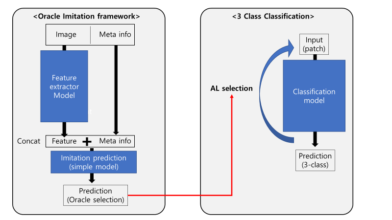

# Oracle Imitating Selection

## Framework Overview

## Purpose

To develop more effective Active Learning (AL) patch recommendations

## Methods

1. **Building Oracle Selection Classification Model (Version 1)**
   - Construct a classification model for oracle selection

2. **Enhanced Model (Version 2)**
   - Extract features from images
   - Concatenate image features with meta-information:
     - Whole Slide Image (WSI) ground truth
     - Patch prediction from DenseNet201 pretrained model
     - Patch confidence score from DenseNet201 pretrained model

## Active Learning Strategy

The project implements an AL strategy that combines the uncertainty from the AL process and the probability of oracle selection from the oracle-imitating selection model.
